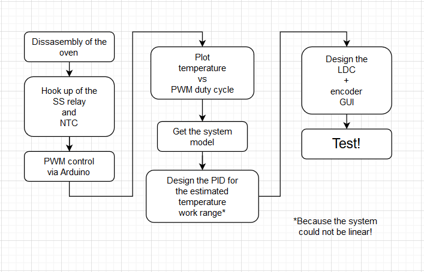
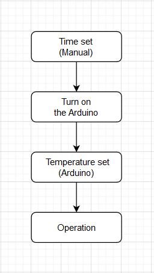

# Ovuino
Arduino project focused on controlling the temperature inside an oven

This is a small project focused on learning some basic skills on Arduino and PID control. The main goal of this project is to control the temperature good enough so I can dry filament for my 3D printers or even try drying some food.  

### This project has five main problems to solve:
 * Temperature measurement inside the oven
 * Displaying temperature
 * Setting the setpoint with a rotary encoder
 * PID temperature control
 * _My lack of experience with any of the above on Arduino_
 
 The intended workflow of the project it's the following:  
 

Also the intended workflow of the system it's the following:  

#### Some things to add in the future:
 * minTemp/maxTemp feature
 * Humidity sensor
 * PID fan speed control
